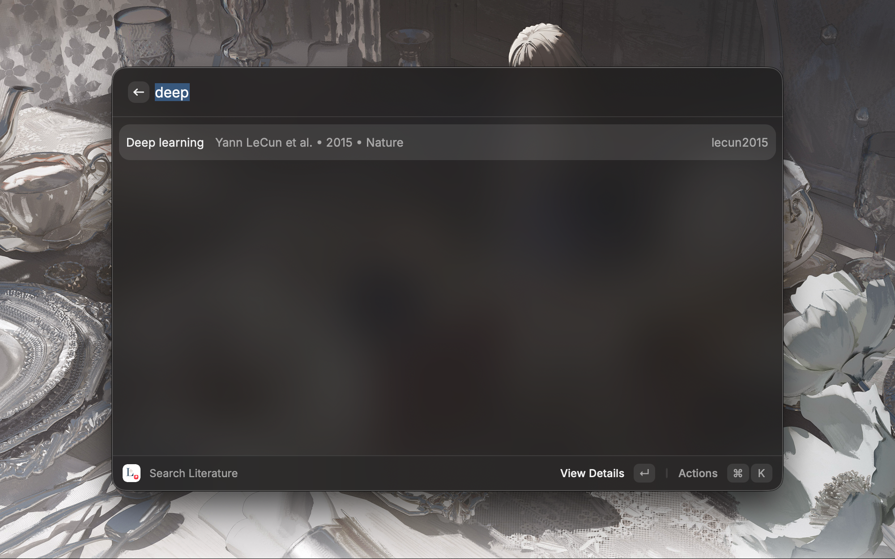
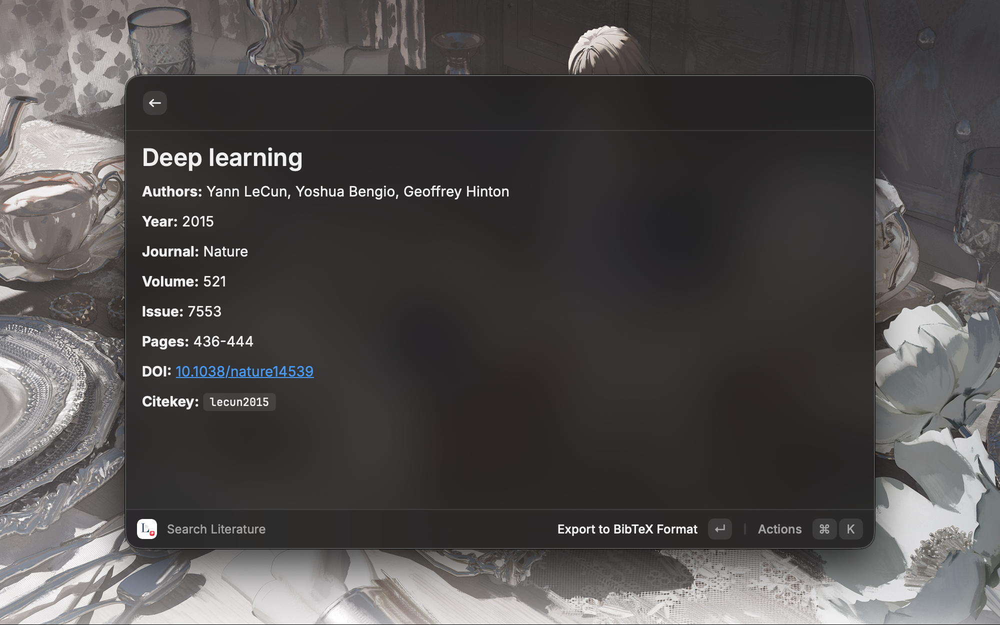
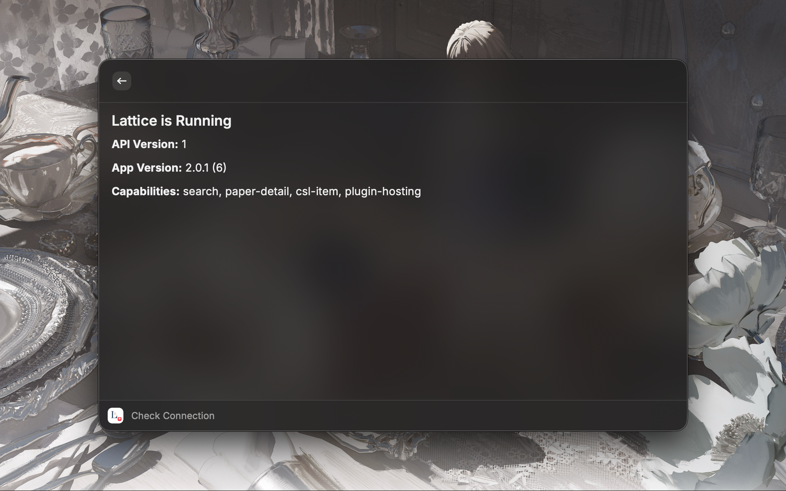

# Lattice Scholar

[中文文档](README.zh-CN.md)

Search your [Lattice](https://apps.apple.com/app/lattice-reference-manager/id6761349832) literature library directly from Raycast — no switching apps, no context loss.

## Features

- **Instant search** across your entire Lattice library as you type
- **Full citation details** — authors, journal, DOI, year, and more
- **Multi-format export** — copy citations in BibTeX, RIS, APA, MLA, Chicago, or EndNote format
- **Quick copy** — copy your preferred format instantly with `⌘ B`
- **DOI detection** — extract paper metadata from the current browser page via CrossRef or arXiv

## Screenshots

## Requirements

- [Lattice](https://apps.apple.com/app/lattice-reference-manager/id6761349832) desktop app must be running
- The local API is served at `http://127.0.0.1:52731` by default — configurable in extension preferences

## Preferences

Open Raycast Preferences (`⌘ ,` → Extensions → Lattice Scholar Extension) to configure:

- **API Port** — port number for the Lattice local API (default: `52731`)
- **Preferred Export Format** — default format for quick copy action (BibTeX, RIS, APA, MLA, Chicago, EndNote)

## Usage

### Search Literature

1. Open Raycast and run **Search Literature**
2. Type any part of a title, author, or keyword
3. Press `↵` to open the detail view, or use the action panel (`⌘ K`) to copy citation data

**Keyboard shortcuts in search results:**
- `⌘ B` — Copy citation in your preferred format (configurable in preferences)
- `⌘ ⇧ E` — Export to more formats (BibTeX, RIS, APA, MLA, Chicago, EndNote)
- `⌘ ⇧ C` — Copy citekey
- `⌘ O` — Open DOI in browser

### Find Paper by Current Page

1. Open a paper page in your browser (arXiv, journal site, etc.)
2. Run **Find Paper by Current Page** in Raycast
3. The command detects the DOI from the page URL or content and displays paper metadata
4. Copy the DOI, citation, or open the paper at doi.org

Requirements: [Raycast Browser Extension](https://www.raycast.com/browser-extension)

## Tips: Alias & Hotkey

For faster access, assign an alias or hotkey to the **Search Literature** command in Raycast Preferences (`⌘ ,` → Extensions → Lattice Scholar Extension).

- **Alias** — type a short keyword (e.g. `las`) to launch the command without scrolling through the list
- **Hotkey** — bind a global shortcut (e.g. `⌥ ⌘ L`) to open the search from anywhere

