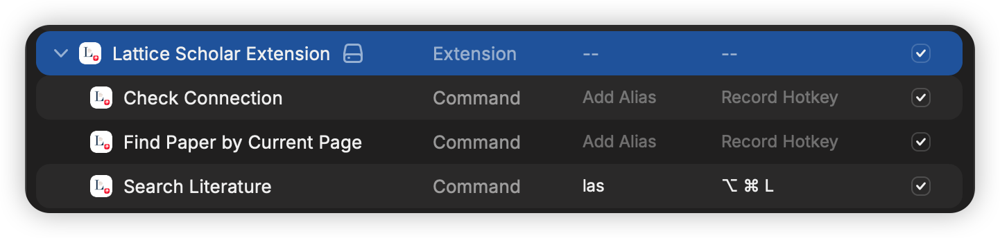

# Lattice Scholar

[English](README.md)

直接在 Raycast 中搜索你的 [Lattice](https://apps.apple.com/app/lattice-reference-manager/id6761349832) 文献库——无需切换应用，保持专注。

## 功能

- **即时搜索** — 边输入边搜索，实时检索整个文献库
- **完整引用信息** — 作者、期刊、DOI、年份等一览无余
- **多格式导出** — 支持 BibTeX、RIS、APA、MLA、Chicago、EndNote 等多种引用格式
- **快速复制** — 使用 `⌘ B` 一键复制首选格式
- **DOI 识别** — 从当前浏览器页面提取论文元数据（支持 CrossRef 和 arXiv）

## 截图

## 使用前提

- 需要运行 [Lattice](https://apps.apple.com/app/lattice-reference-manager/id6761349832) 桌面应用
- 本地 API 默认地址为 `http://127.0.0.1:52731`，可在扩展偏好设置中修改

## 偏好设置

在 Raycast 偏好设置（`⌘ ,` → 扩展 → Lattice Scholar Extension）中可进行配置：

- **API Port** — Lattice 本地 API 的端口号（默认：`52731`）
- **Preferred Export Format** — 快速复制操作的默认格式（BibTeX、RIS、APA、MLA、Chicago、EndNote）

## 使用方法

### 搜索文献

1. 打开 Raycast，运行 **Search Literature**
2. 输入标题、作者或关键词的任意部分
3. 按 `↵` 进入详情页，或通过操作面板（`⌘ K`）复制引用数据

**搜索结果中的快捷键：**
- `⌘ B` — 以首选格式复制引用（可在偏好设置中配置）
- `⌘ ⇧ E` — 导出为更多格式（BibTeX、RIS、APA、MLA、Chicago、EndNote）
- `⌘ ⇧ C` — 复制 citekey
- `⌘ O` — 在浏览器中打开 DOI

### 识别当前页面论文

1. 在浏览器中打开论文页面（arXiv、期刊网站等）
2. 在 Raycast 中运行 **Find Paper by Current Page**
3. 命令会自动从页面 URL 或内容中识别 DOI 并显示论文元数据
4. 复制 DOI、引用信息，或在 doi.org 打开论文

使用前提：[Raycast Browser Extension](https://www.raycast.com/browser-extension)

## 技巧：别名与快捷键

在 Raycast 偏好设置（`⌘ ,` → 扩展 → Lattice Scholar Extension）中，可以为 **Search Literature** 命令设置别名或全局快捷键，实现更快速的调用。

- **别名** — 输入短关键词（如 `las`）即可直接启动，无需在列表中查找
- **快捷键** — 绑定全局快捷键（如 `⌥ ⌘ L`），在任意界面一键打开搜索

