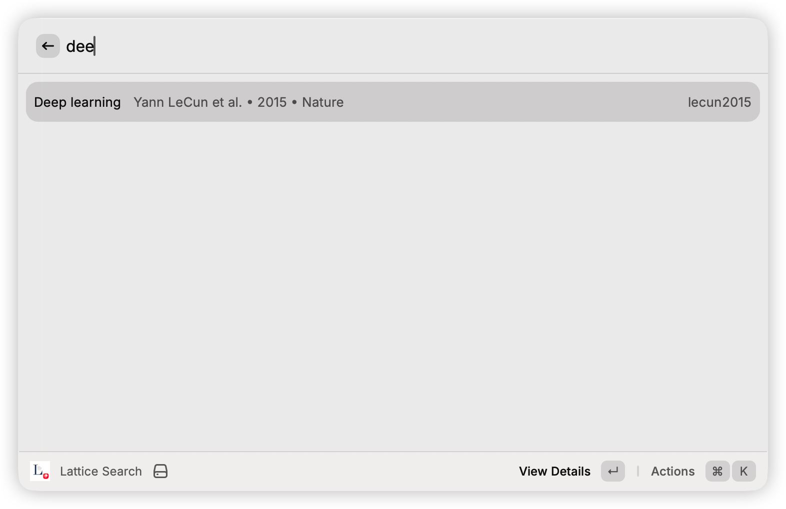
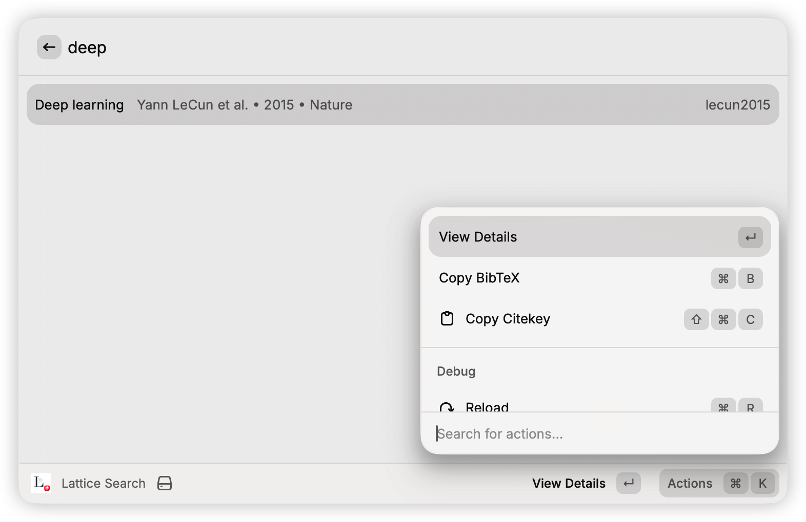
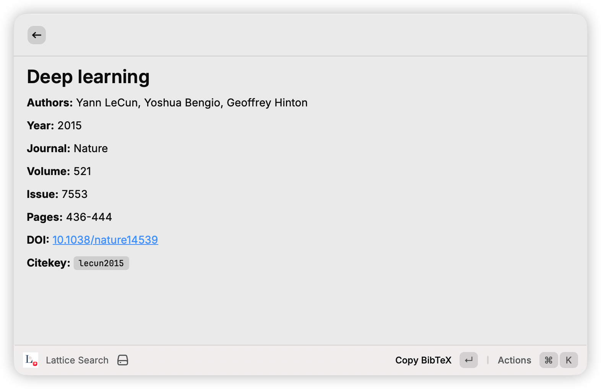
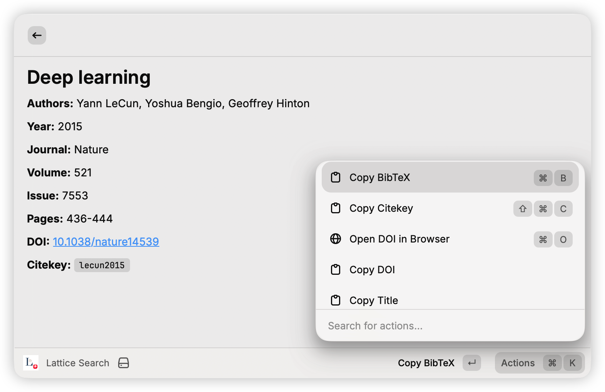
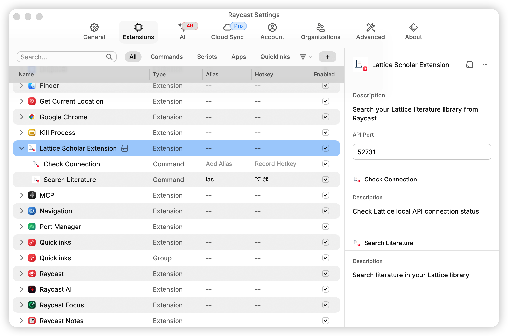
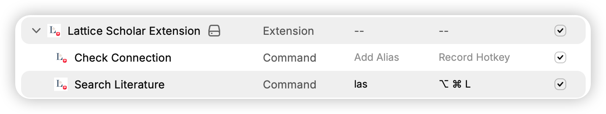

# Lattice Scholar

直接在 Raycast 中搜索你的 [Lattice](https://stringer07.github.io/Lattice_release/) 文献库——无需切换应用，保持专注。

## 功能

- **即时搜索** — 边输入边搜索，实时检索整个文献库
- **完整引用信息** — 作者、期刊、DOI、年份等一览无余
- **快捷复制** — 一键复制 citekey、标题、DOI 或完整 BibTeX

## 截图

## 使用前提

- 需要运行 [Lattice](https://stringer07.github.io/Lattice_release/) 桌面应用
- 本地 API 默认地址为 `http://127.0.0.1:52731`，可在扩展偏好设置中修改

## 偏好设置

在 Raycast 偏好设置（`⌘ ,` → 扩展 → Lattice Scholar Extension）中可进行配置：

- **API Port** — Lattice 本地 API 的端口号（默认：`52731`）

## 使用方法

1. 打开 Raycast，运行 **Lattice Search**
2. 输入标题、作者或关键词的任意部分
3. 按 `↵` 进入详情页，或通过操作面板（`⌘ K`）复制引用数据

## 技巧：别名与快捷键

在 Raycast 偏好设置（`⌘ ,` → 扩展 → Lattice Scholar Extension）中，可以为 **Search Literature** 命令设置别名或全局快捷键，实现更快速的调用。

- **别名** — 输入短关键词（如 `las`）即可直接启动，无需在列表中查找
- **快捷键** — 绑定全局快捷键（如 `⌥ ⌘ L`），在任意界面一键打开搜索

